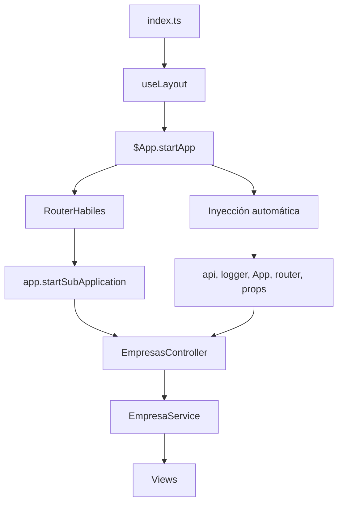

# Patrón DI Descentralizado en Habiles (versión vigente)

Esta es la documentación oficial y vigente del módulo Habiles, alineada con:
- Inversión de dependencias (DI) **descentralizada** en Router/Controllers/Services/Views.
- Eliminación de globales como `$App`, `$.ajax`, `Empresa` y navegación global.
- Plantillas unificadas con imports `?raw` y compilación única con `_.template`.
- Delegación de toda I/O de backend al `Service` usando `this.api`.

## Dependencias inyectadas (patróncentralizado por módulo)
- `api`: cliente HTTP (this.api.get/post/delete...)
- `App`: bus de eventos/UX (this.app.trigger, this.app.download)
- `logger`: logging de errores/diagnóstico
- `router`: navegación interna (router.navigate('ruta', { trigger: true }))
- `EmpresaModel`: modelo tipado inyectado a vistas que crean/usan instancias

## Estructura por capa
- RouterHabiles: resuelve rutas y delega en Controllers
- Controllers: crean Layout, muestran vistas en regiones y conectan eventos al Service
- EmpresaService: lógica de dominio y acceso a API; métodos públicos `__*` y privados `*Api`
- Vistas (BackboneView): UI, emiten eventos; NO hacen I/O
- Layout/Region: infraestructura de renderizado; regiones con guards

## Flujo de inicialización (Descentralizado)
1) `index.ts` usa `useLayout` para montar el layout y llama `$App.startApp(RouterHabiles, options)`.
2) `$App` inyecta `api`, `logger`, `App` en el Controller base automáticamente.
3) `RouterHabiles` recibe `app` por constructor y crea Controllers vía `app.startSubApplication()`.
4) `Controller` hereda dependencias del base y crea `EmpresaService` con `{ api, App, logger }`.
5) El `Controller` crea `LayoutView`, muestra vistas en regiones y conecta eventos a métodos `__*` del Service.

## Vistas: opciones y ejemplos
- Ejemplo `EmpresaEditarView`/`EmpresaCrearView`:
```ts
new EmpresaEditarView({ model, router, api, App, EmpresaModel })
// Internamente: this.modelUse = options.EmpresaModel
```
- `EmpresaDetalleView` recibe `EmpresaModel` y usa plantilla `detalle_empresa.hbs?raw`.
- `EmpresaMasivoView` emite `file:upload` con `FormData` y no hace llamadas HTTP.

## EmpresaNav (navegación y acciones)
- Usa `this.router.navigate(...)` en lugar de `$App.router`.
- Confirmaciones vía `this.app.trigger('confirma', { message, callback })`.
- Emite eventos `export:lista` y `export:informe` para que los Controllers deleguen al Service.

## EmpresaService: interfaz pública y privados
- Públicos (consumidos por Controllers/Vistas):
  - `__findAll`, `__setEmpresas`, `__addEmpresas`, `__removeEmpresa`
  - `__setHabiles`, `__addHabiles`, `__removeHabil`
  - `__saveEmpresa`, `__notifyPlataforma`
  - `__uploadMasivo({ formData, callback })`
  - `__exportLista()` y `__exportInforme()`
- Privados (solo Service):
  - `findAllApi`, `saveEmpresaApi`, `removeHabilApi`, `notifyPlataformaApi`, etc.
- Acceso HTTP: siempre `this.api` (sin `syncro` ni `$.ajax`).

## Plantillas y render
- Todas las vistas importan templates con `?raw` y los compilan una sola vez:
```ts
import tpl from '../templates/view.hbs?raw'
this.template = _.template(tpl)
```
- `ModelView` usa `_.isFunction`/`_.isString` para renderizar/compilar.

## Guards de regiones
- Siempre verificar regiones antes de usar `show`:
```ts
const sub = layout.getRegion('subheader'); if (sub) sub.show(navView)
const body = layout.getRegion('body'); if (body) body.show(view)
```

## Ejemplo de inicialización (Patrón Descentralizado)

### index.ts (Punto de entrada)
```typescript
import useLayout from "@/componentes/useLayout";
import $App from "@/core/App";
import RouterHabiles from "./RouterHabiles";

const Habiles = {
    mount(el: HTMLElement, props: BackendAuthProps): void {
        const { layout } = useLayout(props);
        
        $App.startApp(RouterHabiles, {
            defaultRoute: "listar",
            mainRegion: layout.getRegion('content'),
            props
        });
    }
};
```

### RouterHabiles.ts
```typescript
export default class RouterHabiles extends BackboneRouter {
    constructor(options: RouterHabilesOptions) {
        super({ routes: { listar: 'listaEmpresas' } });
        this.app = options.app;  // Inyección directa
        this._bindRoutes();
    }

    listaEmpresas(): void {
        this.init();
        this.controller?.listaEmpresas();
    }

    init() {
        this.controller = this.app.startSubApplication(EmpresasController);
    }
}
```

### EmpresasController.ts
```typescript
export default class EmpresasController extends Controller {
    constructor(options: any) {
        super(options);  // Hereda: this.api, this.App, this.logger
        
        this.empresaService = new EmpresaService({
            api: this.api,      // Inyección directa
            app: this.app,
            logger: this.logger,
            EmpresaModel: Empresa
        });
    }
}
```

## Convenciones
- Métodos Service públicos: prefijo `__`.
- Privados con sufijo `Api` para llamadas HTTP.
- Tipos/Options por vista y controller; evitar `any` en código nuevo.
- Vistas no conocen de API ni de almacenamiento; emiten eventos.

## 🏗️ Arquitectura Detallada del Patrón Descentralizado

### 📦 **Componentes Clave del Sistema**

#### 1. **$App (Core/App.ts) - Orquestador Central**
```typescript
// $App es el SINGLETON que gestiona el ciclo de vida
startApp(RouterModule, options) {
    // Inyecta automáticamente: api, logger, props, router
    // Configura eventos globales: alert:*, confirma, syncro, upload/download
    // Inicia Backbone History y routing
}

startSubApplication(SubApplication) {
    // Crea Controller con dependencias inyectadas
    // Retorna instancia con Backbone.Events extendidos
}
```

#### 2. **Controller Base (common/Controller.ts) - Herencia de Dependencias**
```typescript
export class Controller {
    // Propiedades inyectadas automáticamente por $App
    api: ApiService | null = null;
    app: AppInstance | null = null; 
    logger: Logger | any;
    region: Region;
    router: any;
    props: any;
    
    startController(ControllerClass) {
        // Factory con inyección de dependencias
        // Maneja ciclo de vida: destroy() si existe instancia previa
    }
}
```

#### 3. **Router con App Inyectada**
```typescript
export default class RouterHabiles extends BackboneRouter {
    constructor(options: RouterHabilesOptions) {
        this.app = options.app;  // Inyección directa del $App
    }
    
    init() {
        // Usa app.startSubApplication() - NO new Controller()
        this.controller = this.app.startSubApplication(EmpresasController);
    }
}
```

### 🔄 **Flujo Completo de Inicialización**



### 🎯 **Patrones de Inyección por Capa**

#### **Capa 1: $App (Singleton Global)**
- **Responsabilidad**: Orquestar ciclo de vida, eventos globales, inyección base
- **Inyección**: `api`, `logger`, `props`, `router` automáticos
- **Eventos**: `alert:*`, `confirma`, `syncro`, `upload`, `download`

#### **Capa 2: Router (Específico del Módulo)**
- **Responsabilidad**: Resolver rutas, delegar a controllers
- **Inyección**: `app` por constructor
- **Patrón**: `app.startSubApplication()` vs `new Controller()`

#### **Capa 3: Controller (Hereda del Base)**
- **Responsabilidad**: Orquestar vistas, conectar eventos
- **Inyección**: Hereda `api`, `App`, `logger`, `region` del base
- **Patrón**: `super(options)` + inyección manual al Service

#### **Capa 4: Service (Inyección Explícita)**
- **Responsabilidad**: Lógica de negocio, acceso a API
- **Inyección**: Constructor explícito `{ api, App, logger, EmpresaModel }`
- **Patrón**: Métodos públicos `__*`, privados `*Api`

#### **Capa 5: Views (Inyección Opcional)**
- **Responsabilidad**: UI, eventos de usuario
- **Inyección**: Por `options` cuando necesitan acceso
- **Patrón**: `trigger(event, data)` → Controller → Service

### 🔧 **Patrones Específicos de Habiles**

#### **1. Doble Inyección de Controller**
```typescript
// RouterHabiles crea controllers de dos formas:
init() {
    // 1) Controller principal (hereda de Controller base)
    this.controller = this.app.startSubApplication(EmpresasController);
}

// 2) Controllers específicos (startController factory)
listaEmpresas() {
    const controller = this.startController(EmpresaListar);  // Factory con inyección
    controller.listaEmpresas();
}
```

#### **2. Colecciones Compartidas entre Controllers**
```typescript
// EmpresasController tiene colecciones globales
this.Collections = {
    empresas: new EmpresasCollection(),
    habiles: new HabilesCollection(),
};

// Service accede a las mismas colecciones
this.empresaService.initializeCollections(); // BoxCollectionStorage
```

#### **3. Eventos Multi-nivel**
```typescript
// Nivel 1: View → Controller
this.trigger('remove:empresa', { model, callback });

// Nivel 2: Controller → Service  
this.listenTo(listView, 'remove:empresa', this.empresaService.__removeEmpresa);

// Nivel 3: Service → App (global)
this.App?.trigger('alert:success', { message: response.msj });
```

#### **4. Layouts Anidados con Guards**
```typescript
// Layout principal (useLayout)
const layout = new LayoutMain();
region.show(layout);

// Layout específico del módulo
const moduleLayout = new LayoutView();
this.region.show(moduleLayout);

// Guards obligatorios
const subheader = layout.getRegion('subheader');
if (subheader) subheader.show(navView);
```

### 📊 **Ciclo de Vida y Gestión de Memoria**

#### **Inicialización**
```typescript
index.ts → useLayout() → $App.startApp() → Router → Controllers → Services
```

#### **Destrucción Limpia**
```typescript
destroy(): void {
    if (this.region && typeof this.region.remove === 'function') {
        this.region.remove();  // Limpia DOM
    }
    
    if (typeof this.stopListening === 'function') {
        this.stopListening();  // Limpia eventos Backbone
    }
}
```

#### **Factory Pattern para Controllers**
```typescript
startController(ControllerClass): any {
    // 1) Reutiliza instancia si existe
    if (this.currentController && this.currentController instanceof ControllerClass) {
        return this.currentController;
    }
    
    // 2) Destruye anterior si existe
    if (this.currentController && this.currentController.destroy) {
        this.currentController.destroy();
    }
    
    // 3) Crea nueva con inyección
    this.currentController = new ControllerClass({
        region: this.region,
        api: this.api,
        props: this.props,
        logger: this.logger,
        router: this.router
    });
}
```

### 🎯 **Características Únicas del Patrón Habiles**

#### **1. Herencia Mixta**
- Controllers heredan de `Controller` base (inyección automática)
- Services usan inyección explícita (constructor)
- Views usan inyección opcional (options)

#### **2. Eventos Globales Centralizados**
- `$App` gestiona todos los eventos: `alert:*`, `confirma`, `syncro`
- Services notifican vía `this.app.trigger()`
- Controllers escuchan y delegan a services

#### **3. Storage Persistente**
```typescript
// BoxCollectionStorage para persistencia
initializeCollections(): void {
    const empresas = this.storage.getCollection('empresas')?.value;
    if (empresas) this.Collections.empresas = new EmpresasCollection(empresas);
}
```

#### **4. Navegación Router-less en Views**
```typescript
// Views reciben router por options
if (this.router && typeof this.router.navigate === 'function') {
    this.router.navigate('detalle/' + nit, { trigger: true });
}
```

### ⚡ **Optimizaciones de Performance**

#### **1. Lazy Loading de Colecciones**
```typescript
// Solo carga si no existen o están vacías
if (!this.Collections.empresas || !this.Collections.empresas.length) {
    await this.api.get('/habiles/listar');
}
```

#### **2. DataTables Integration**
```typescript
init_table(): void {
    this.tableModule = tableElement.DataTable({
        paging: true,
        pageLength: 10,
        // Configuración optimizada
    });
}
```

#### **3. Loading States Centralizados**
```typescript
if (Loading) Loading.show();
// ... operación
if (Loading) Loading.hide();
```

### 🔄 **Comparación con Otros Módulos**

| Característica | Habiles | Otros Módulos |
|---------------|---------|---------------|
| **Inyección** | Herencia + Explícita | Centralizada (CommonDeps) |
| **Controllers** | Doble nivel (main + específicos) | Single level |
| **Colecciones** | Compartidas + Storage | Independientes |
| **Eventos** | 3 niveles (View→Controller→Service→App) | 2 niveles |
| **Layouts** | Anidados con guards | Simple |
| **Router** | Inyectado en views | Centralizado |

---

## Beneficios del Patrón Descentralizado

### ✅ **Ventajas sobre el patrón centralizado**
- **Simplicidad**: Sin bootstrap ni Composition Root adicional
- **Autonomía**: Cada módulo controla sus dependencias
- **Evolución gradual**: Puedes refactorizar módulos individualmente
- **Menos boilerplate**: No requiere archivos de configuración central
- **Flexibilidad**: Cada módulo puede adaptar sus dependencias

### 📦 **Componentes por módulo**
- **index.ts**: `$App.startApp()` con opciones específicas del módulo
- **Router**: Recibe `app` por constructor, crea controllers vía `app.startSubApplication()`
- **Controller**: Hereda dependencias base (`api`, `App`, `logger`), inyecta al Service
- **Service**: Recibe dependencias explícitas en constructor
- **Views**: Reciben dependencias por `options` cuando necesitan acceso a API/modelos

### 🔄 **Flujo de dependencias**
```
index.ts → $App.startApp() → Router → Controller → Service → Views
    ↓           ↓              ↓        ↓         ↓
   props    inyección       app     api/App    options
```

Este documento describe la arquitectura y los flujos aplicados en la página Habiles usando Vanilla JS, Backbone-like (Bone), y Inertia como capa de orquestación desde Laravel.

## Visión general
- **Objetivo**: separar responsabilidades (UI, navegación, negocio y datos) aplicando principios SOLID/DRY.
- **Capas principales**:
  - **Router**: resuelve rutas de la subaplicación y delega en controladores.
  - **Controller**: orquesta regiones, layouts, vistas y servicios.
  - **Service**: encapsula la lógica de negocio y el acceso a la API.
  - **Views**: componentes de UI (BackboneView) que emiten/escuchan eventos.
  - **App/Region/Layout**: infraestructura de la SPA (contenedores y zonas de render).

## Estructura de archivos relevante
- Router y controladores
  - `EmpresasController.ts`
  - `EmpresasHabiles.ts`
  - `EmpresaCrear.ts`, `EmpresaEditar.ts`, `EmpresaDetalle.ts`, `EmpresaMasivo.ts`
- Servicio de dominio
  - `EmpresaService.ts`
- Vistas
  - `componentes/habiles/views/*`
- Entrada de página
  - `index.ts`

## Flujo de inicialización (Inertia → App → SubApp)
1. `index.ts` usa `useLayout` para montar el layout de la página.
2. Llama a `$App.startApp(RouterHabiles, { defaultRoute, mainRegion, props })`.
3. `App` crea/usa `mainRegion` y setea `props` comunes (api, logger, etc.).
4. El `Router` resuelve la ruta (e.g. `listar`) y llama a un método del `Controller`.
5. El `Controller` crea un `LayoutView`, muestra las vistas en regiones y conecta eventos a métodos del `Service`.

## Roles y responsabilidades
- Router
  - Define rutas (`listar`, `detalle/:id`, `crear`, `cargue`, etc.).
  - Resuelve cada ruta y ejecuta `controller.main().<acción>()`.
- Controller
  - Inyecta `api`, `App`, `logger`, `region`.
  - Crea `LayoutView` y muestra vistas en regiones (`body`, `subheader`).
  - Conecta eventos de las vistas con `EmpresaService` (e.g. `form:save`, `remove:habiles`).
  - Gestiona ciclo de vida (`destroy`): `region.remove()` y `stopListening()`.
- Service (EmpresaService)
  - Mantiene `Collections` locales (`empresas`, `habiles`).
  - Expone métodos públicos con prefijo `__` para ser utilizados por controllers/vistas.
  - Internamente delega a métodos privados que consumen API (`findAllApi`, `removeHabilApi`, `notifyPlataformaApi`).
  - Persiste/restaura colecciones con `BoxCollectionStorage` cuando aplica (`initializeCollections`).
- Views
  - Renderizan UI, recogen datos del formulario y emiten eventos (e.g. `form:save`).
  - No conocen detalles de API ni almacenamiento.

## Comunicación por eventos
- UI → Service (vía Controller)
  - La vista emite: `form:save`, `form:edit`, `remove:habiles`, `notify`, etc.
  - El controller hace `listenTo(view, 'form:save', service.__saveEmpresa)`.
- Service → App/UI
  - Notificaciones: `this.App?.trigger('alert:success'|'alert:error', { message })`.
  - Mutaciones de colecciones: `Collections.empresas.add(...)`, `Collections.habiles.remove(...)`.

## Acceso a API
- Se evita el mecanismo `syncro` y se usa `this.api` directamente.
- Patrones de implementación:
  - GET: `const response = await this.api.get('/habiles/listar')`.
  - POST: `await this.api.post('/habiles/saveEmpresaHabil', payload)`.
  - DELETE: `await this.api.delete(`/habiles/removeEmpresa/${id}`)`.
- Manejo de errores uniforme con `try/catch`, log con `logger` y feedback con `App.trigger('alert:*')`.

## Colecciones y almacenamiento
- Inicialización perezosa: `initEmpresas()`, `initHabiles()`.
- Adición/actualización: `add(..., { merge: true })`.
- Persistencia opcional vía `BoxCollectionStorage` usando `initializeCollections()`.

## Ejemplos de uso
- Listar empresas (desde controller):
```ts
await this.api?.get('/habiles/listar');
this.empresaService.__setEmpresas(response.empresas);
layout.getRegion('body').show(listView);
```
- Guardar empresa (desde view → controller → service):
```ts
// view
this.trigger('form:save', { model, callback });
// controller
this.listenTo(view, 'form:save', this.empresaService.__saveEmpresa);
// service (privado)
await this.api.post('/habiles/saveEmpresaHabil', model.toJSON());
```
- Remover habil:
```ts
this.listenTo(listView, 'remove:habiles', this.empresaService.__removeHabil);
// service → removeHabilApi → Collections.habiles.remove(model)
```

## Convenciones
- Métodos públicos de servicio: prefijo `__` (interfaz para controllers/vistas).
- Métodos privados de servicio: nombre semántico `*Api()` para llamadas HTTP.
- Notificaciones: `alert:success` / `alert:error` con `{ message }`.
- Tipado TS: evitar `any` en código nuevo. Donde exista legado, encapsular en el service.

## Guía para extender
1. Crear una vista y su template.
2. Añadir ruta en el Router y método en el Controller que:
   - construya `LayoutView`,
   - instancie la vista,
   - conecte eventos con `EmpresaService`.
3. Implementar en `EmpresaService` los métodos `__*` públicos y `*Api` privados.
4. Actualizar colecciones y emitir notificaciones.

## Ciclo de vida y limpieza
- Cada controller implementa `destroy()`:
  - `this.region.remove()` para desmontar contenido.
  - `this.stopListening()` para evitar fugas de eventos.

## Beneficios del patrón
- Aísla UI de la lógica de negocio y del transporte.
- Facilita pruebas unitarias del service y de las views independientes.
- Permite migrar gradualmente de `syncro` a API estándar.
- Escalable para nuevas rutas y funcionalidades.


# 1) Inyección explícita en Router/Controller/Service
Define opciones tipadas y pásalas por constructor.

```ts
// pages/Habiles/types.ts
import type ApiService from '@/core/ApiService';
import type Logger from '@/common/Logger';
import type { Region } from '@/common/Region';
import type { AppInstance } from '@/types/types';

export interface CommonDeps {
  api: ApiService;
  logger: Logger;
  app: AppInstance;
  region: Region;
}
```

```ts
// pages/Habiles/EmpresaService.ts (fragmento)
export interface EmpresaServiceOptions {
  api: ApiService;
  logger: Logger;
  app: AppInstance;
  // si requieres storage, pásalo aquí también
}

export default class EmpresaService {
  constructor(private readonly opts: EmpresaServiceOptions) {}

  private get api() { return this.opts.api; }
  private get logger() { return this.opts.logger; }
  private get App() { return this.opts.app; }

  async findAllApi(): Promise<void> {
    try {
      const response = await this.api.get('/habiles/listar');
      if (response?.success) {
        this.__setEmpresas(response.empresas);
      } else {
        this.app.trigger('alert:error', { message: response.msj });
      }
    } catch (e:any) {
      this.logger.error('Error al listar empresas:', e);
      this.app.trigger('alert:error', { message: e.message || 'Error de conexión' });
    }
  }
}
```

```ts
// pages/Habiles/EmpresasController.ts (fragmento)
import { Controller } from '@/common/Controller';
import { CommonDeps } from './types';
import EmpresaService from './EmpresaService';
import LayoutView from '@/componentes/layouts/views/LayoutView';

interface EmpresasControllerOptions extends CommonDeps {}

export default class EmpresasController extends Controller {
  private service: EmpresaService;
  private region: Region;

  constructor(options: EmpresasControllerOptions) {
    super(options);
    this.region = options.region;
    this.service = new EmpresaService({
      api: options.api,
      logger: options.logger,
      app: options.app,
    });
  }

  async listaEmpresas(): Promise<void> {
    const layout = new LayoutView();
    this.region.show(layout);
    await this.service.findAllApi();
    // ...
  }
}
```

```ts
// pages/Habiles/RouterHabiles.ts (fragmento)
import { BackboneRouter } from '@/common/Bone';
import type { CommonDeps } from './types';
import EmpresasController from './EmpresasController';

interface RouterHabilesOptions extends Partial<CommonDeps> {}

export default class RouterHabiles extends BackboneRouter {
  constructor(private deps: CommonDeps, options: RouterHabilesOptions = {}) {
    super({ ...options, routes: { listar: 'listaEmpresas' } });
    this._bindRoutes();
  }

  listaEmpresas(): void {
    const controller = new EmpresasController(this.deps);
    controller.listaEmpresas();
  }

  // factoriza si necesitas main() reutilizable
}
```

# 2) Punto de entrada de página sin globales
El index de la página recibe `props`, compone dependencias y arranca.

```ts
// pages/Habiles/index.ts (fragmento)
import useLayout from '@/componentes/useLayout';
import RouterHabiles from './RouterHabiles';
import { createDeps } from '@/core/bootstrap';

const Habiles = {
  mount(el: HTMLElement, props: any) {
    const { layout } = useLayout(props);
    const deps = createDeps('#contentView', props);

    const mainRegion = layout.getRegion('content');
    const router = new RouterHabiles({ ...deps, region: mainRegion });

    // si tu App necesita conocer Router, pásalo como prop, no por global
    deps.app.startSubApplication(/* ... */);
  }
};

export default Habiles;
```

# 3) Evitar `$App` globales
- `$App`: ya se inyecta como `app` y se usa vía `this.App`.

Ejemplo en una View:
```ts
// En vez de usar globals en la view, pasa por options:
interface EmpresaEditarViewOptions {
  EmpresaModel: typeof Empresa;
  // ...
}

constructor(options: EmpresaEditarViewOptions) {
  super(options);
  this.modelUse = options.EmpresaModel;
}
```
